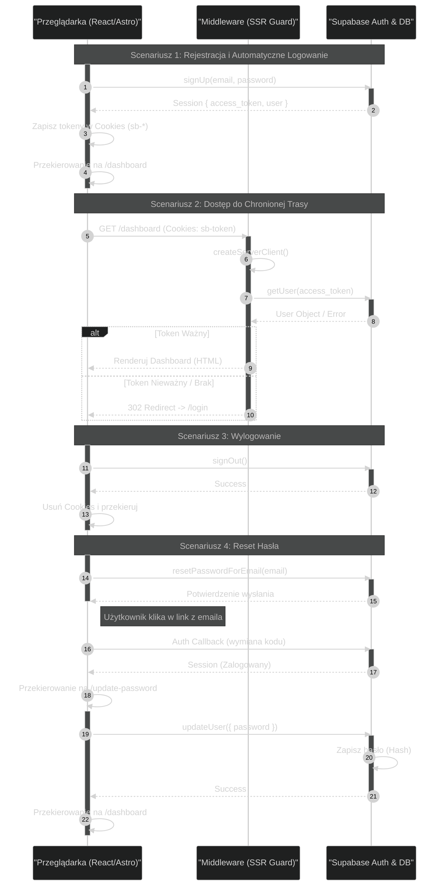

# Analiza Autentykacji

<authentication_analysis>

1. **Przepływy autentykacji**:
   - **Rejestracja (US-001)**: Użytkownik tworzy konto, następuje automatyczne logowanie (bez wymuszonej weryfikacji email na start MMP), zapisanie sesji w ciasteczkach i przekierowanie do Dashboardu.
   - **Logowanie (US-002)**: Użytkownik podaje dane, Supabase zwraca sesję, klient zapisuje ciasteczka, następuje przekierowanie.
   - **Wylogowanie (US-003)**: Klient wywołuje wylogowanie, ciasteczka są czyszczone, użytkownik ląduje na stronie logowania.
   - **Reset hasła (US-004)**: Żądanie resetu -> Email z linkiem -> Kliknięcie loguje użytkownika -> Użytkownik ustawia nowe hasło.
   - **Ochrona tras (Middleware)**: Weryfikacja sesji po stronie serwera (SSR) dla każdej chronionej podstrony.

2. **Aktorzy i interakcje**:
   - **Przeglądarka (Klient React)**: Inicjuje akcje (formularze), zarządza stanem UI (toasty, przekierowania), komunikuje się bezpośrednio z Supabase Client.
   - **Middleware (Astro Server)**: Strażnik tras. Sprawdza ciasteczka `sb-access-token` przy każdym żądaniu do `/dashboard/*`.
   - **Supabase Auth**: Zewnętrzny dostawca tożsamości. Wystawia tokeny (JWT), obsuguje logikę biznesową auth.

3. **Weryfikacja i odświeżanie**:
   - Tokeny (`access_token`, `refresh_token`) są przechowywane w ciasteczkach (`httpOnly` zalecane, ale `supervisor/ssr` zarządza nimi hybrydowo).
   - Middleware używa `createServerClient` do weryfikacji tokenu przy renderowaniu po stronie serwera.
   - Klient (Browser) automatycznie odświeża token w tle dzięki bibliotece Supabase.

</authentication_analysis>

# Diagram Autentykacji

