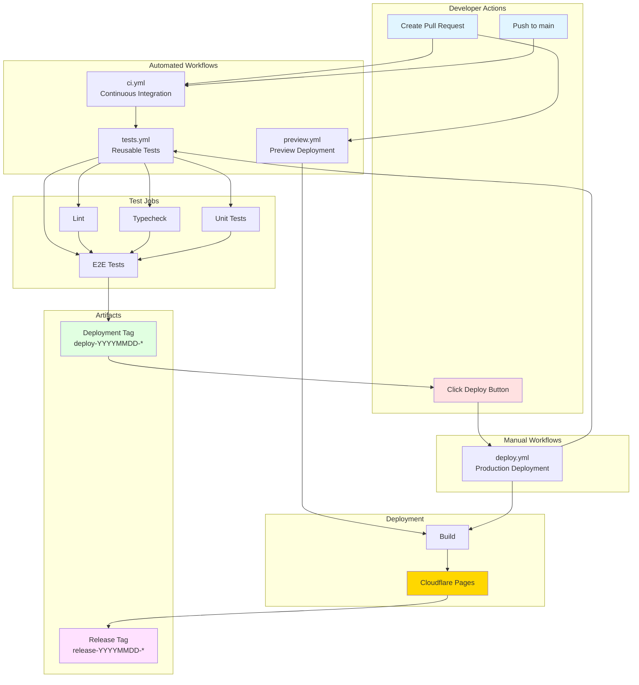
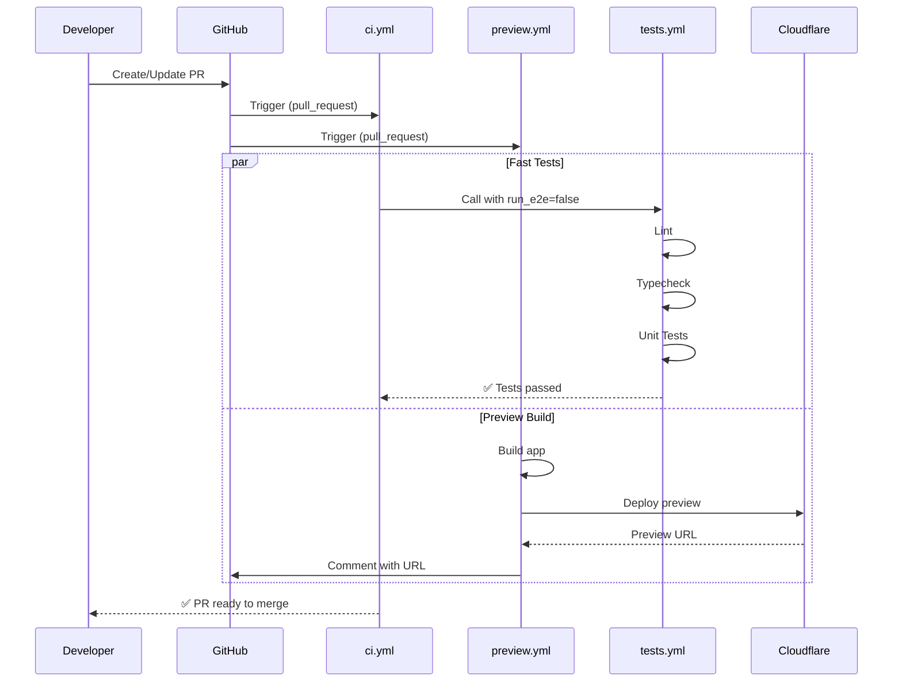
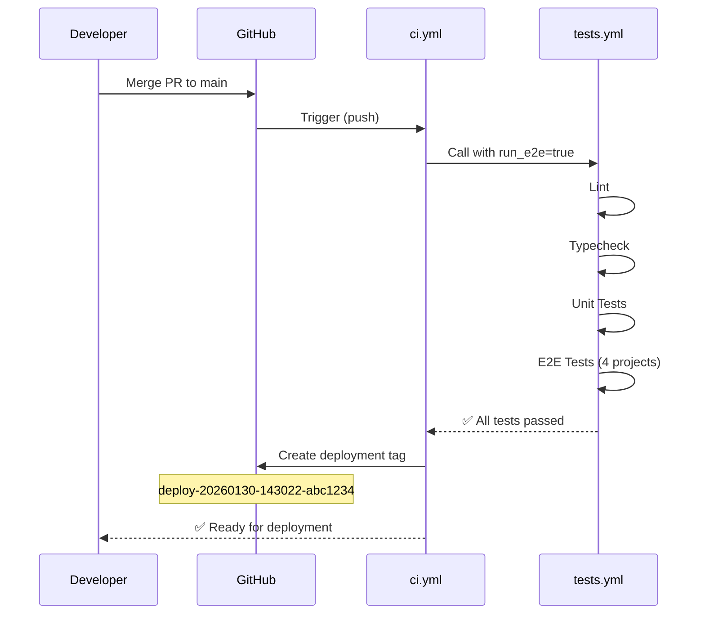
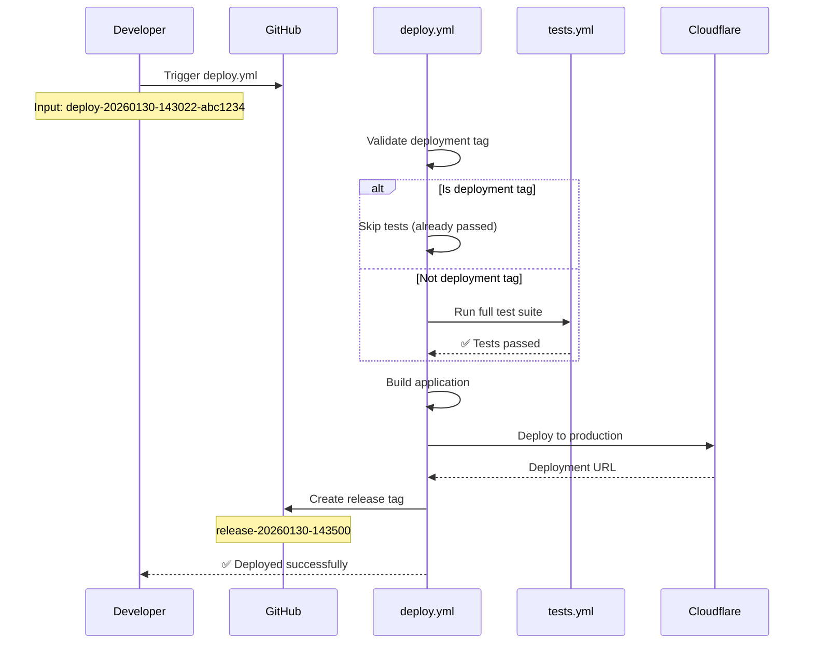
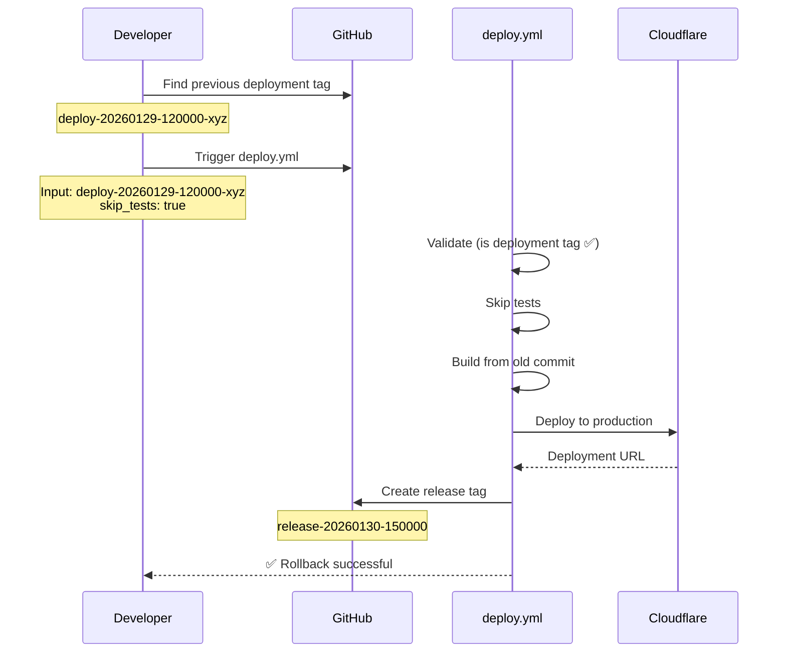

# CI/CD Architecture

## 🏗️ Architecture Diagram

## 🔄 Workflow Flow

### 1. Pull Request Flow

### 2. Main Branch Flow (After Merge)

### 3. Production Deployment Flow

### 4. Rollback Flow

## 🎯 Key Design Decisions

### 1. **Reusable Test Workflow**
**Decision:** Extract tests into separate `tests.yml` workflow

**Pros:**
- ✅ DRY principle - single source of truth for tests
- ✅ Easy to maintain and update test logic
- ✅ Can be called from multiple workflows
- ✅ Can be triggered manually for debugging

**Cons:**
- ❌ Slightly more complex workflow structure
- ❌ Requires understanding of `workflow_call`

**Verdict:** ✅ Worth it for maintainability

---

### 2. **E2E Tests Only on Main**
**Decision:** Skip E2E tests on PRs, run only on main

**Pros:**
- ✅ Fast feedback on PRs (< 2 min vs 15+ min)
- ✅ Saves GitHub Actions minutes
- ✅ Reduces flakiness impact on PRs
- ✅ Main branch is still fully tested

**Cons:**
- ❌ E2E bugs discovered after merge
- ❌ Might need to revert broken commits

**Mitigation:**
- Preview deployments allow manual testing
- Can trigger `tests.yml` manually with E2E before merge if needed

**Verdict:** ✅ Standard practice in industry

---

### 3. **Deployment Tags**
**Decision:** Auto-create `deploy-*` tags after tests pass on main

**Pros:**
- ✅ Clear marker of tested commits
- ✅ Easy rollback (just deploy old tag)
- ✅ Deployment history in git tags
- ✅ Can deploy any tested commit, not just latest

**Cons:**
- ❌ Creates many tags over time
- ❌ Requires tag cleanup strategy

**Mitigation:**
- Tags are lightweight (just pointers)
- Can clean up old tags periodically (keep last 50)

**Verdict:** ✅ Elegant solution for deployment tracking

---

### 4. **Manual Deployment Only**
**Decision:** No auto-deploy to production, only `workflow_dispatch`

**Pros:**
- ✅ Control over when to deploy
- ✅ Can batch multiple commits
- ✅ Can schedule deployments
- ✅ Requires explicit approval

**Cons:**
- ❌ Extra manual step
- ❌ Slower time-to-production

**Verdict:** ✅ Right choice for production apps

---

### 5. **Preview Deployments**
**Decision:** Auto-deploy every PR to Cloudflare Pages preview

**Pros:**
- ✅ Test in production-like environment
- ✅ Share with stakeholders
- ✅ Visual QA before merge
- ✅ Free on Cloudflare (500 builds/month)

**Cons:**
- ❌ Uses build quota
- ❌ Exposes preview URLs (not behind auth)

**Mitigation:**
- Preview URLs are random/hard to guess
- Can add basic auth if needed

**Verdict:** ✅ Huge productivity boost

---

### 6. **Build Artifacts Retention**
**Decision:** Keep build artifacts for 7 days, test reports for 3 days

**Pros:**
- ✅ Can debug recent deployments
- ✅ Saves storage costs
- ✅ Enough time for investigation

**Cons:**
- ❌ Can't debug very old deployments

**Verdict:** ✅ Good balance

---

## 🔒 Security Considerations

### Secrets Management
- ✅ All secrets stored in GitHub Secrets (encrypted)
- ✅ Production secrets in `production` environment
- ✅ Testing secrets in `testing` environment
- ✅ Preview deployments use production secrets (read-only operations)

### Branch Protection
- ✅ Main branch protected (requires PR + tests)
- ✅ Can't push directly to main
- ✅ Requires status checks to pass

### Environment Protection
- ✅ Production requires manual approval
- ✅ Can add wait timer (e.g., 5 min cooldown)
- ✅ Can restrict to specific users/teams

### Deployment Safety
- ✅ Tests must pass before deployment
- ✅ Build must succeed before deploy
- ✅ Can rollback quickly if issues found

